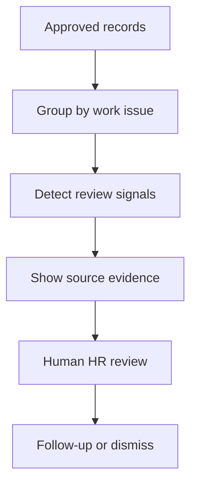

# PENCIL Bridge

> From translation to shared understanding.

[](https://pencil-bridge-test.lovable.app)
[](https://nextjs.org/)
[](https://www.typescriptlang.org/)
[](https://github.com/Jsmitty78/pencil-people-bridge/actions/workflows/prototype-ci.yml)

PENCIL Bridge is a bilingual, HR-only decision-support prototype that detects possible gaps in shared understanding across existing workplace records. It organizes evidence around a work issue, shows HR why the issue was flagged, and keeps every final decision with a person.

This was developed during the **PENCIL Co., Ltd. internship** in the **Kyushu University QREC Venture Life Challenge 2026**. It is a student internship prototype, not an official PENCIL product or a production HR system.

| | |
| --- | --- |
| **Live demo** | [pencil-bridge-test.lovable.app](https://pencil-bridge-test.lovable.app) |
| **Demo data** | Fictional and anonymized scenarios only |
| **Languages** | Japanese and English |
| **Project status** | Completed internship prototype, August 2026 |
| **Final scope** | Working local data-to-detection flow and simulated HR review workflow |

## The problem

Important decisions can become scattered across meetings, Backlog, Chatwork, Box, and verbal conversations. HR often sees the outcome of a misunderstanding without having the time or source context needed to reconstruct how it happened.

PENCIL Bridge explores a narrower question:

> Can approved workplace records be grouped around an issue so HR can notice missing context, contradictory instructions, and unusual rework earlier?

It does this without scoring employees, diagnosing people, or asking staff to maintain another system.

## What the prototype does

- Loads ten fictional work issues containing 40 records across Backlog, Chatwork, meeting notes, and Box.
- Detects explicit instruction conflicts, undocumented verbal decisions, rework signals, and acknowledgement followed by clarification.
- Groups findings around an issue or work product instead of a person.
- Shows the original evidence and a neutral follow-up question to HR.
- Provides an interactive review queue with reviewed, follow-up, and false-positive states.
- Separates private HR analysis from an HR-approved staff clarification draft.
- Builds a weekly HR report and simulates its delivery state.
- Exports review data as CSV.
- Supports Japanese and English throughout the interface.
- Stores demonstration cases in browser-local IndexedDB so the public demo does not require confidential company data.

## Product flow



The prototype demonstrates **Detect + part of Understand**. Live company connectors, authentication, and production data governance remain future work.

## Quick demo

1. Open the [live demo](https://pencil-bridge-test.lovable.app).
2. Select **Data & Detection / データ登録・検知**.
3. Load the ten fictional cases.
4. Run the detection pipeline.
5. Open **Review Queue / 確認キュー** and inspect the evidence timeline.
6. Mark a case reviewed, add it to follow-up, or label it a false positive.
7. Add selected cases to the weekly HR report.

The interface labels simulated connectors and notification states. No live message is sent from the demo.

## Run locally

Requirements:

- Node.js 22
- npm

```bash
git clone https://github.com/Jsmitty78/pencil-people-bridge.git
cd pencil-people-bridge
npm ci
npm run dev
```

Open [http://localhost:3000](http://localhost:3000).

The deterministic detection flow runs without an external AI service. Optional local semantic contradiction checking uses Ollama:

```bash
ENABLE_LOCAL_NLI=true
OLLAMA_BASE_URL=http://localhost:11434
OLLAMA_MODEL=qwen3:4b
```

Do not enter confidential or identifiable employee information unless the company has explicitly approved the environment, access scope, retention, and review process.

## Architecture

| Layer | Current prototype | Production requirement |
| --- | --- | --- |
| Sources | Fictional Backlog, Chatwork, meeting, and Box records | Approved read-only connectors |
| Storage | Browser-local IndexedDB | Approved encrypted storage and retention policy |
| Detection | Deterministic rules with optional local Ollama NLI | Evaluated model, thresholds, and monitoring |
| Review | Interactive HR review queue | Authentication, authorization, and audit trail |
| Delivery | CSV and simulated weekly report | Approved HR workflow integration |

More detail: [system design alignment](docs/system-design-alignment.md).

## Guardrails

- HR-only output.
- Issue-level analysis, never employee scoring.
- No emotion, personality, health, or sensitive-trait inference.
- No hiring, firing, promotion, discipline, compensation, or legal recommendations.
- Every detection is a review candidate, not a conclusion.
- Original evidence remains available to the human reviewer.
- Human approval is required before any staff-facing clarification.
- No confidential PENCIL data is stored in this repository.

## Honest prototype boundary

Implemented:

- Working stored-data-to-detection pipeline
- Ten fictional cases and 40 source records
- Source evidence timelines
- HR review and feedback states
- Browser-local case persistence
- Japanese and English UI
- Weekly report and notification simulation
- CSV export
- Optional local Ollama analysis
- Responsive desktop, tablet, and mobile layouts

Not implemented:

- Live Backlog, Chatwork, Box, or meeting-record connectors
- External notifications
- Production authentication or role-based access control
- Approved storage and retention policy
- Completed privacy, security, or APPI review
- Company-wide testing or deployment

## Suggested pilot

Start with one approved department for four weeks using read-only access. Measure:

- Useful findings and false positives
- Weekly HR review time
- Preventable rework identified earlier
- Time to clarify a conflicting instruction
- Staff and HR trust in the review process

Stop and review the pilot before expanding its scope.

## Repository guide

| Path | Purpose |
| --- | --- |
| [`app/`](app/) | Next.js application and API routes |
| [`docs/DEMO_SCRIPT.md`](docs/DEMO_SCRIPT.md) | Five-minute product demonstration |
| [`docs/PROJECT_ARCHIVE.md`](docs/PROJECT_ARCHIVE.md) | Internship timeline, decisions, outcomes, and final presentation record |
| [`docs/system-design-alignment.md`](docs/system-design-alignment.md) | Prototype-to-production gap analysis |
| [`docs/employee-pilot-kit.md`](docs/employee-pilot-kit.md) | Fictional validation scenarios and feedback prompts |
| [`SECURITY.md`](SECURITY.md) | Privacy and security reporting guidance |

## Team

| Member | Primary contribution |
| --- | --- |
| [Jake Smith](https://www.linkedin.com/in/jake-smith-japan/) | Prototype, product direction, demo, and technical delivery |
| [Sydney Magnolia Tjandra](https://www.linkedin.com/in/sydney-magnolia-tjandra/) | Design, filming, financial presentation support, and presentation delivery |
| [Takeshi Yamamoto](https://www.linkedin.com/in/takeshi-yamamoto-3a9339360/) | Employee research, engineering support, subtitles, and presentation delivery |

## Project principle

**AI organizes the problem. Humans handle the relationship.**
